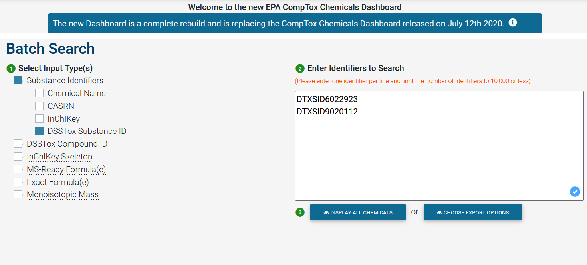
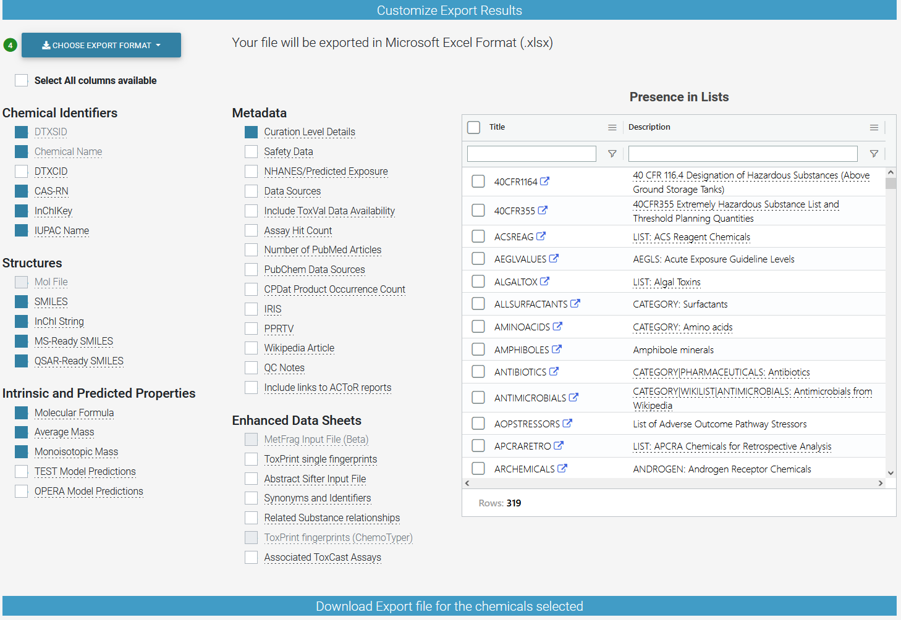

<!-----
title: "REcoTox - A  workflow to process US EPA ECOTOX Knowledgebase ASCII files"
author: "Tobias Schulze"
date: '2023-05-0'
output: pdf_document -->
---

# Background

The search and extraction of experimental ecotoxicological information is often a tedious work. A good and comprehensive data source is the [US EPA ECOTOX Knowledgebase](https://cfpub.epa.gov/ecotox/ "US EPA ECOTOX Knowledgebase"). It contains about 1 million data points for more than 12,000 chemicals and 13,000 single species. However, for a high-throughput hazard assessment, it is not possible to extract all relevant data of the online database The purpose of REcoTox is to extract the relevant information and to aggregate the data based on the user criteria out of the entire database [ASCII files](https://gaftp.epa.gov/ecotox/ecotox_ascii_03_10_2022.zip "ECOTOX Knowledgebase ASCII files").

# Introduction

[REcoTox](https://github.com/tsufz/REcoTox) is a semi-automated, interactive workflow to process [US EPA ECOTOX Knowledgebase](https://cfpub.epa.gov/ecotox/ "US EPA ECOTOX Knowledgebase") entire database [ASCII files](https://gaftp.epa.gov/ecotox/ecotox_ascii_03_10_2022.zip "ECOTOX Knowledgebase ASCII files") to extract and process ecotoxicological data relevant (but not restricted) to the ecotoxicity groups algae, crustaceans, and fish in the aquatic domain. The latest version of the [ASCII files](https://gaftp.epa.gov/ecotox/ecotox_ascii_03_15_2023.zip) is available on [US EPA ECOTOX Knowledgebase](https://cfpub.epa.gov/ecotox/ "US EPA ECOTOX Knowledgebase"). The focus is aquatic ecotoxicity and the unit of the retrieved data is `mg/L`.

For use of [REcoTox](https://github.com/tsufz/REcoTox), clone the repository to your computer:

`git clone https://github.com/tsufz/REcoTox.git`

The workflow expects an `R version >4.3.0`. Please install additionally the `R packages` `Tidyverse`, `data_table`, `EnvStats`, and `webchem`.

# Workflow

The file `Query_Ecotox_DB.R` contains the workflow and loads all relevant packages and functions. The workflows allows to filter for endpoints, measurements, and species. The ecotoxicity data is interactivitely enriched with chemical information (e.g. the average mass). In best case with data linked to [US EPA CompTox Chemicals Dashboard](https://comptox.epa.gov/dashboard/ "US EPA CompTox Chemicals Dashboard") for example by using the output of the [batch search](https://comptox.epa.gov/dashboard/batch-search "US EPA CompTox Chemicals Dashboard Batch Search") according to Figure 1 and Figure 2.

At least, the molecular weight or average mass is required for the recalculation of the water concentrations from molar to milligrams. The main purpose of this workflow is to generate data for the hazard assessment of chemical pressures to aquatic organisms. Thus, only relevant data is aggregated and all data is calculated to `mg/L`.

The data output contains `long pivot` tables containing all filtered datasets as the basis of further data processing and aggregation for the users' purposes. But it includes also a further pivoting step to `wider pivot` tables containing aggregated information, e.g. the geomean and the 5-percentile of the extracted data for each chemical, endpoint, and species.

# Note

This workflow will be further developed. Contributions and suggestions are welcome. Please create an [issue](https://github.com/tsufz/REcoTox/issues) to initialize the discussion.
