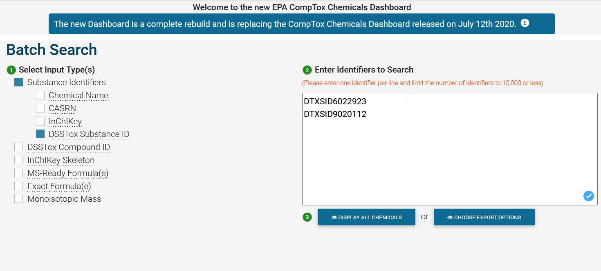

```{r biocstyle, echo = FALSE, messages = FALSE, results = "hide"}
BiocStyle::markdown()
```

```{r init, message = FALSE, echo = FALSE, results = "hide" }
## Silently loading all packages
library(BiocStyle)
library(desc)
library(dplyr)
library(kableExtra)
```

# Introduction

`MZquant` is a comprehensive, semi-automated computational mass
spectrometry workflow for the high-throughput target screening.
`MZquant` builds on the compelling mass spectrometry suite
[`MZmine3`](https://mzmine.github.io "MZmine 3") [@MZmine2;
@Pluskal_Castillo_Villar-Briones_Oresic_2010]. `MZmine 3` is required
for preprocessing of the raw mass spectrometrical data. However, it
includes no advanced module for the targeted screening.

`MZquant` processes the `MZmine 3` export files in `csv` format in the
following main steps:

-   Feature list workflow

    -   preprocessing of the `MZmine 3` output file including selection
        of custom-defined columns to remove unused columns from the full
        `MZmine 3` output.

    -   interactive editing of the processed `csv` to justify column
        names or else (optional)

    -   preparation of internal feature lists (e.g., samples, blanks,
        quantification, quality control)

    -   assignment of a standardized name for all compounds to prevent
        name confusions during processing

    -   interactive removal of duplicate annotations and review of
        missing compounds

-   Blank workflow

    -   annotation of blank features

    -   removal of blank features by different computational approaches
        (optional)

-   Quantification workflow

    -   automated, interactive assignment of quantification levels
    
    -   annotation of all features with the nearest neighbor internal
        standard or a preselected internal standard, if defined in the
        `substance_table`
    
    -   normalization of all features to the assigned internal standard
    
    -   modelling and trimming of the quantification models
    
    -   fitting of quantification models
    
    -   interactive trimming of compounds with failed automated trimming
    
    -   automated quantification of the samples and export to a `csv`
        file

`MZquant` processes the `MZmine 3` export files in `csv` format. It expects an
aligned feature list with full annotation of the features of interest.

**Note:** `MZquant` expects the use of spiked (isotopically labeled) internal
standards because of quality assurance. Samples, calibrations, and quality
standards without spiked internal standards cannot be processed. In best case,
the mix of standards spans the full chromatographic range. Spiked blanks 
should be treated as samples, because the features related to internal
standards might be removedby blank correction.

**Note for users of `MZquant` versions <0.8.0**: The change to the new
`MZmine 3` output format required a refactorisation of the internal
data model in `MZquant`. Unfortunately, old projects cannot be reprocessed.

# Input files

`MZquant` requires a comma separated file (`csv`) in the `MZmine 3`
format ([Figure 1](#fig1)). The standardized delimiter of `csv` is a
`comma`. Other delimiters are not supported. If in-field separation is
required, for example in comment field, the use of the pipe `|` symbol
is recommended or semicolon `;` ([Figure 2](#fig2)). However, it is
strongly recommended to use the pipe `|`.

<a id="fig1"></a>
```{r}
#| fig1,
#| fig.cap = "Export feature lists in MZmine 3.",
#| fig.align = "center", out.width = "75%",
#| echo = FALSE, eval = TRUE

```
<a id="fig2"></a>
```{r}
#| fig2,
#| fig.cap = "Export options in MZmine 3.",
#| fig.align = "center", out.width = "75%",
#| echo = FALSE, eval = TRUE
knitr::include_graphics("./figures/Figure_2.png")
```

**Notes**

-   It is recommended to use the identical `substance_table` for the annotation
    in `MZmine 3` and `MZquant` for consistent results.
    
-   Do not change the `MZmine 3` output file manually to avoid a
    corruption. Run `feature_list_workflow(step = 1)` to clean the file
    first before preview and any editing.

## New field schema in `MZmine 3` output format

### Field groups in `MZmine 3` output format

In the `MZmine 3` output format, related columns are tagged with a group
prefix:

-   `manual_annotation:` tags related to manual annotations in
    `MZmine 3`
    
-   `compound_db_identity:` tags related to automated annotations using
    a custom database
    
-   `datafile:` columns containing sample data

-   other columns like `id`, `mz`, or `rt`

The overall number of columns exported is immense. Do not edit the
original output, but the refined file after running
`feature_list_workflow(step = 1)`.

### Response format

The response (i.e. `area` and `intensity`) is tagged by a suffix of the
`datafiles`, for example:

`datafile:file_name.mzML:area` or `datafile:file_name.mzML:intensity`

`MZmine 3` exports both, `area` and `intensity`. In the `MZquant_settings.yaml`
of `MZquant`, it is possible to select the preferred method for
quantification. The default is `area`.

## Name conventions for smart processing in `MZquant`

### Calibrations

The calibration columns need to be tagged by a name like "Cal", "Calib"
or "Calibration" followed by the concentration level of the standard.
The exact tag needs to be specified in the `MZquant_settings.yaml` (details see
below).

*A good name of a column representing a calibration sample looks like:*

`datafile:190303_09_Cal_100_ngL_2018.mzML:area`

In case, the calibration levels contain not a decimal (i.e., 0.5ng L),
but it is as "p" (i.e. 0p5), replace the "p" by a "." and add an
underline between the value and the unit.

*For example:*

`datafile:190303_09_Cal_0.5_ngL_2018.mzML:area`

*Should be replaced by:*

`datafile:190303_09_Cal_0p5ngL_2018.mzML:area`

With a correct tagging of the calibration levels, it is possible to
generate the calibration-to-levels table automatically.

### Blanks

Blanks should be tagged with the name `Blank` or `blank`. The exact tag
needs to be specified in the settings (see below). It is recommended to
remove the first blank of a sequence because it is very noisy due to
carry-over of previous measurements.

*Examples for correct tagging:*

`datafile:190303_15_Blank95.5.mzML:area`

`datafile:190303_16_Trip_Blank.mzML:area`

### Quality Controls (QC)

Usually at the end of every batch, you can find some calibration samples
for quality control to check if the chromatography and acquisition was
stable during the batch run. The name pattern of these samples is
usually similar to the name pattern of the calibration. To use those
samples for quality control, replace `Calib` or `Cal` by `QC`. If not,
these samples will be handled as additional calibration points.

### Internal Standards (IS)

In general, it is necessary to spike a mix of internal standards (IS) in
your samples for quality assurance (for example to correct for matrix
effects).

**Note:** Without IS spiked into your samples, you cannot use MZquant.

The IS are allocated at the end of the `substance_table`. In addition to
the main IS, the list includes the isotopes and adducts of many IS. The
regular name of an IS ends with `M+H` or `M-H` The suspect internal
standards can end by `_13C`, `_13S`, `_34S`, `_37Cl` among others.

The names of internal standards must be tagged with an unequivocal
prefix, for example `IS_compound_name`. The tag must be defined in the
`MZquant_settings.yaml`.

Check the raw data for missing IS. Almost all IS should be found in the
samples, if not, redo the `MZmine 3` analysis with refined parameters.

If an IS cannot be found or contains more than 50% of missing values,
open the `MZquant_substances.csv` and re-classify the IS entry as a `Suspect`
(column `Class`) and set the quantification tag to `auto`.

You may consider using an isotope or adduct as an alternative? No
problem. In this case, change the column `Class` to `Internal Standard`
and set the quantification tag to `IS`.

However, missing values in the IS data can be handled automatically by
`MZquant`. Do not impute any value. The only appropriate imputation
method is K nearest neighbors (KNN), which is used by `MZquant`.

Other values such as the mean or median do bias the data. But in the
case of more than 50% of missing values, the KNN algorithm imputes the
mean values, because KNN cannot handle too many missing values. To
customize, this setting can be changed in the `MZquant_settings.yaml`.

In the latter case, you may consider removing the IS or replacing it by
the isotope or adduct anyway. The re-classification of IS is also
possible on a later stage in the `MZquant` feature list workflow. Hence,
no action is required at this stage.

If an IS was not found in any sample, calibration or blank, it will be
separated from the dataset such as missing compounds.

### Important Note

**Never** delete rows from your feature list or the substance file. This
is a major cause of failures. Missing compounds and internal standards
in the feature list will be removed from analysis automatically.

Furthermore, `MZquant` provides procedures to remove or rename
annotations, and to reclassify internal standards. `MZquant` cares about
the changes in all tables including the `substance_table`.

Experienced users can edit the annotations in `MZmine` or using the
refined `MZmine` output file in an external spreadsheet application
(preferable LibreOffice [@LibreOffice]).

# Using MZquant

The following tutorial explains the different steps of `MZquant` in a
comprehensive demonstration. `MZquant` includes different interactive
steps, which require the evaluation of comma separated text files
(`*.csv`) in an external spreadsheet application (preferable LibreOffice
[@LibreOffice]).

## Load the MZquant package

```{r load MZquant package, eval = TRUE, echo = TRUE, message = FALSE, warning = FALSE}
# Load the MZquant package
library(MZquant)
```

## Documentation for MZquant

A detailed description of all functions of `MZquant` is available in the
`R Documentation`.

```{r R Documentation, echo = TRUE, eval = FALSE}
# Documentation of MZquant
help(package = "MZquant")
```

## Preparation of the working environment (for beginners)

The processing of annotated feature lists in MZquant is semi-automated
controlled by a processing script `MZquant_processing_script.R` and a
settings file `MZquant_settings.yaml`.

If you run MZquant for the first time, a tutorial project is available
to demonstrate all important steps of MZquant processing. The following
script is preparing an example folder in your home directory and copies
all necessary files in the folder.

```{r initialize project folder, echo = TRUE, message = FALSE, warning = FALSE, eval = TRUE}
# Path of the project folder
project_folder <- "your_folder"
settings_file <- "MZquant_settings.yaml"

# The project folder is created in the home directory
project_folder <- normalizePath(ifelse(.Platform$OS.type == "unix",
    paste0("~/", project_folder),
    paste0(
        Sys.getenv("HOMEPATH"),
        "\\",
        project_folder
    )
))

# An existing folder is deleted
if (dir.exists(project_folder)) {
    unlink(project_folder, recursive = TRUE)
}
```

This command initializes the project folder and copies the demonstration
project in the project folder.

```{r initialize project, echo = TRUE, message = FALSE, warning = FALSE, eval = TRUE}
# Initialization and setup of the project folder.
# default_settings = TRUE loads the default settings file
# default_example = TRUE loads the example files
initialise_project(project_folder, settings_file,
    default_processing_script = TRUE,
    default_settings = TRUE,
    default_example = TRUE
)
```

The `project_folder` contains the following files and directories:

```{r list project folder}
# List files and directories in project_folder
list.files(project_folder, recursive = TRUE, include.dirs = TRUE)
```

`MZquant_processing_script.R` is the processing script of the MZquant
workflow, `MZquant_settings.yaml` is the settings file,
`MZquant_samples.csv` contains the results exported of MZmine, and
`MZquant_substances.csv` contains the chemical information on the
targets used for annotation.

## Review of the input data

To review the input data, let us look in the data in a short view. For a
detailed review, use the next chunk.

```{r view samples, echo = TRUE, eval = TRUE}
# Review of the samples table
samples <- readr::read_csv(file = normalizePath(path = file.path(
    project_folder,
    "MZquant_samples.csv"
), ), show_col_types = FALSE)

kable(
    samples %>%
        head(5) %>%
        dplyr::select(
            id, mz, rt, `compound_db_identity:compound_db_identity`,
            `datafile:220101_18_ESIpos_Calib_std_1000_ngL.mzML:area`
        ),
    format = "html", digits = 2
)
```

```{r view substances, echo = TRUE, eval = TRUE}
# Review of the substance_table
substances <-
    readr::read_csv(
        file = normalizePath(
            path = file.path(
                project_folder,
                "MZquant_substances.csv"
            ),
        ),
        show_col_types = FALSE
    )

kable(
    substances %>%
        head(5) %>%
        dplyr::select(
            id, mz, rt, compound_id, `mzquant:compound_class`,
            `mzquant:mode`
        ),
    format = "html", digits = 2
)
```

To get a detailed overview of the input data, run the following chunk.

```{r view input data, echo = TRUE, eval = FALSE}
# Review input data in detail
samples <- readr::read_csv(
    file.path(
        project_folder,
        "MZquant_samples.csv"
    ),
    show_col_types = FALSE
)
View(samples)

substances <- readr::read_csv(
    file.path(
        project_folder,
        "MZquant_substances.csv"
    ),
    show_col_types = FALSE
)
View(substances)
```

## Preparation of the working environment (for experienced users)

Experienced users can re-use existing `MZquant_processing_script.R` and
`MZquant_settings.yaml` files.^[Note that the workflow and the settings file can change in a new
    package version and thus a review of the change log (NEWS) is recommended.]

The steps to setup a custom project are:

1.  Create a project folder.^[It is recommended to use the same name as the analytical batch.]

2.  Copy the custom `MZquant_substances.csv` and the `MZquant_samples.csv` in the folder.

3.  Re-use existing `MZquant_processing_script.R` and/or `MZquant_settings.yaml`
    files.

4.  Or, create new files with the following command.

```{r initialize new processing files, echo = TRUE, message = FALSE, warning = FALSE, eval = FALSE}

# Initialization and setup of the project folder
project_folder <- "your_folder"
settings_file <- "MZquant_settings.yaml"

# default_settings = TRUE loads the default settings file
# default_processing_script = TRUE loads the default processing script
initialise_project(project_folder, settings_file,
    default_processing_script = TRUE,
    default_settings = TRUE,
    default_example = FALSE
)
```

The command will initialize the project folder and copy the default
`MZquant_settings.yaml` and the default `MZquant_processing_script.R` in
your project folder. If you copied existing files in step 3 with similar
names, they will be overwritten by step 4.

## MZquant processing and settings

Open the `MZqant_processing_script.R` and the settings file
`MZquant_settings.yaml` for review and further processing.

```{r load processing and settings file, echo = TRUE, eval = FALSE}

# Open the processing script
file.edit(file.path(project_folder, "MZquant_processing_script.R"))

# Open the settings file
file.edit(file.path(project_folder, settings_file))
```

### The processing script

The `MZquant_processing_script.R` contains all necessary steps of the
MZquant workflow described in this vignette.

The data of the `MZquant` project is stored in a hidden environment
`.MZquant.env`.

To review the hidden environment, you may call.

```{r call enviroment, eval = FALSE, echo = TRUE}
View(.MZquant.env)
```

The `.MZquant.env` is stored after each processing step to ensure easy
redo of single processing steps without need to repeat the whole
analysis.

### The settings file

The settings file `MZquant_settings.yaml` contains all necessary and
customization settings. Scroll thought the document and make all
required edits, for example:

-   How are the blanks tagged (e.g., `Blank`)?
-   How are the calibration columns tagged?
-   How are the quality control columns tagged?
-   Should a blank correction be performed?
-   Which type of blank correction is performed?

Finally, save the file and go back to the processing script
`MZquant_processing_script.R`.

The settings file is read in the current `.MZquant.env` environment by
running:

```{r read in settings, eval = FALSE, echo = TRUE}
# Call the read_settings function to read the filed settings
# into the current `.MZquant.env`
read_settings(settings_file, project_folder)
```

The `read_settings()` function is especially helpful if settings are
changed during analysis or old projects are reprocessed with a newer
version of `MZquant`. In the latter case, new features or bug fixes can
be easily applied without need of the tedious reprocessing of the entire
data.

## Feature list workflow

The `feature_list_workflow` reads the `MZquant_samples.csv` and the
`MZquant_substances.csv`. It prepares the feature tables for the
analysis in MZquant.

### Feature list workflow step 1

Step 1: Read `MZmine 3` exported feature list `MZquant_samples.csv` and
the substance file `MZquant_substances.csv`.

```{r}
#| feature list workflow step 1, echo = TRUE,
#| message = FALSE, warning = FALSE, eval = TRUE

# Feature list workflow step 1
feature_list_workflow(step = 1)
```

-   Read the `MZmine 3` exported feature list and the `substance_table`.

-   Merge the tables.

-   Assign standard names (`compound_db_identity:stdname`) to the
    annotations in the `feature list` and the `substance_table`.

-   Assign the response method set in `MZquant_settings.yaml:data:response`.

-   Select mandatory and custom fields set in
    `MZquant_settings.yaml:data:meta_mzmine`.

-   Export the new table to `MZquant_samples_refined.csv` in the
    `project_folder`.

The `feature_liste_workflow` step 1 applies a `regular expression` to
the `compound_identity` in the `substance_table`, respectively, to the
column `compound_db_identity:compound_db_identity` in the
`MZquant_samples.csv` to replace any punctuation in the names to ensure
unequivocal standardized names called `stdname`. The `stdname` is one of
the `keys` used in `MZquant`.

The regular expression is:

$$stdname = stringi::stri\_replace\_all\_regex(name, "[[:punct:] \backslash \backslash s]+", "\_")$$

For example, `3,3'-Dichlorobenzidine` is expressed as
`3_3_Dichlorobenzidine`, which is unequivocally processing.

In the `samples_refined.csv`, the `stdname` is stored in
`compound_db_identity:compound_db_identity:stdname.`

Review this table. For experienced users: Take the opportunity to edit
the table to your purposes, for example, add missing QC data by copying
of calibration data.

*Optional: Load the environment after running `quantification_workflow(step = 1)`*

The working environment is stored after each processing step in the root
of the project folder. To reload the environment, run the `load`
command. This is for example helpfully, if a processing required to
break for a while or a `bug` in a later step was tracked down.

```{r load feature_list_workflow_1.RData, echo = TRUE, eval = FALSE, message = FALSE}
# Loads the environment after running `feature_list_workflow(step = 1)
load(
    file = file.path(project_folder, "MZquant_feature_list_workflow_1.RData"),
    envir = .GlobalEnv
)
```

### Feature list workflow step 2

Step 2: Read and preprocess the refined feature list `MZquant_samples_refined.csv`.

```{r feature list workflow step 2, echo = TRUE, message = FALSE, warning = FALSE, eval = TRUE}
# Feature list workflow step 2
feature_list_workflow(step = 2)
```

-   Read the MZmine export.csv file and the `substance_table`.

-   Prepare the internal feature list structure.

-   Match the annotations in the feature list with the
    `substance_table`.

-   Filter missing substances.

The columns in `MZquant_settings.yaml:data:meta_mzmine` and
`MZquant_settings.yaml:data:meta_substances` are appended. The
`feature_list_workflow` step 2 stores three files in the
`results/feature_lists` folder.

```{r list feature_list folder, echo = TRUE}
# List files and directories in the feature list folder
list.files(file.path(project_folder, "results", "feature_lists"),
    include.dirs = TRUE
)
```

The `target_table_for_review.csv` is the relevant spreadsheet for all
edits in the annotated feature list. Open the list in your favorite
spreadsheet application. To preserve the edits for later review, the
file could be saved in the native spreadsheet format (e.g. `ods` or
`xlsx`).

The only columns to be edited (do not edit any other column or delete
any row or entry, this will have side effects and you need to repeat
this step):

-   `remove_annotation` -\> set to `1` for removing annotations

-   `newstdname` -\> add a new `stdname` (from
    `substance_table_for_review.csv`), if necessary (e.g., in case of
    *duplicate masses*)

-   `new_class` -\> class of the annotation (for example of an internal
    standard), `c(Target, Suspect, Internal Standard)`

See the green highlighted columns in [Figure 3](#fig3).

#### Tips for the data review


**Hide columns, use auto filters and freeze rows/columns ([Figure 3](#fig3))**

-   Hide all columns you do not need for review (e.g., `stdname`,
    `compound_id`, `mzquant_id`).

-   Mark the first row and add the auto filter (data \| AutoFilter).

-   Use the Freeze Rows and Columns functions to freeze the header and
    the column with the `StdName`.

-   Columns could be re-arranged, but never delete columns or remove
    rows!

**Hide columns, use auto filters and freeze rows/columns**

-   Use color scales to mark the the blank data the sample data ([Figure
    4](#fig4)).

-   Use the scientific notation for theses columns for straightforward
    comparison.

-   Add `duplicate` conditional formatting to column `stdname` to
    highlight duplicate names ([Figure 5](#fig5))

    
<a id="fig3"></a>
```{r}
#| fig3, fig.cap = "Hide and freeze columns.",
#| fig.align = "center", echo = FALSE, out.width = "80%",
#| eval = TRUE
knitr::include_graphics("./figures/Figure_3.png")
```

<a id="fig4"></a>
```{r}
#| fig4, fig.cap = "Highlight the data with color scales.",
#| fig.align = "center", echo = FALSE, out.width = "100%",
#| eval = TRUE
knitr::include_graphics("./figures/Figure_4.png")
```

<a id="fig5"></a>
```{r}
#| fig5,
#| fig.cap = "Use conditional formatting to annotate duplicates in stdname and remove\\_annotation.",
#| fig.align = "center",
#| echo = FALSE, out.width = "75%", eval = TRUE
knitr::include_graphics("./figures/Figure_5.png")
```

**Data review**

The selection of the correct annotation is not always
straightforward. `MZquant` delivers different qualifiers to support the
decision ([Figure 6](#fig6)).

-   Decision criteria, review the following columns:

    -   expected `mz` from `MZquant_substances.csv`

    -   expected `rt` from `MZquant_substances.csv`

    -   detected `row_mz` in MZmine 3

    -   detected `row_rt` in MZmine 3

    -   `annotation_score` estimated in MZmine 3

    -   `row_mz_delta_ppm` estimated in MZmine 3

    -   `deltart` as the difference between expected and detected
        retention time

    -   `deltamz` as the difference between expected and detected mz

    -   `mz_ppm_error` in ppm estimated in MZquant

    -   `quantification_monotonicity`` to show monotonicity of the
        quantification levels

    -   `counts` in blanks, calibrations, samples, and quality controls

    -   `blank_features_threshold`^[The `blank_features_threshold` is the value which is calculated by
    the blank correction and is the level of blank noise. All features
    with lower intensities than the threshold will be removed in the
    blank_workflow.]

    -   maximum value in the samples

<a id="fig6"></a>
```{r}
#| fig6, fig.cap = "Criteria for the removal of duplicate annotations.",
#| fig.align = "center", echo = FALSE, out.width = "90%",
#| eval = TRUE
knitr::include_graphics("./figures/Figure_6.png")
```

-   Lookup for compounds with low findings in the samples, e.g.:

    -   select for example those records with low sample annotations

    -   lookup for the better annotation score

    -   check if the compound occurs only in the first consecutive
        sample following the highest calibration level

    -   check for their intensity, if they occur only at the noise level
        (1e4. 1e3, compare to blanks), they could be carry over from the
        calibration sample

    -   check if they only occur in QC samples and so on

    -   remove the annotation if the compound is carry over, not
        occurring in samples etc. by setting the value in
        `remove_annotation` to `1`

    -   **Note**: because of the blank correction, some compound without
        values in the samples will occur in the trimming table

-   Lookup for duplicates

    -   Duplicates should be removed from the table; they occur from
        broad peaks, isobaric compounds, retention time shifts, etc.

        -   Check the comment field and lookup for existing entries, for
            example ([Figure 5](#fig5)):

            -   duplicate mass -\> isobaric compounds

            -   check the `missed_substances_for_review.csv` and search
                for the `unit mass`

            -   compare the retention time

            -   copy the `StdName` from the missed table to the field
                `newStdName` to rename the tagging of the compound

In addition a screening of the shapes of the peaks in `MZmine 3` is also
helpful, does keep `MZmine 3` always open until the end of your analysis
([Figure 7](#fig7)). However, the decision is also not always
straightforward, if shapes fit well in all cases ([Figure 8](#fig8)).

It is not always an easy decision, the `deltart` / `deltamz` and the
`mz_ppm_error` might be good for some records, but the ratios
`QC`/`calibration` does not fit well → in cases of concern ask your
supervisors or discuss with colleagues.

Mark all duplicates to be removed by setting the value in
`remove_annotation` to `1` ([Figure 5](#fig5)) or re-annotate them by
setting a new name in `new_StdName`.Lookup for other curious compounds
and remove them if you like.

**Note: If you change to scientific notation, change back to `General`
(`LibreOffice`) or `Standard` (`Excel`) formats to avoid loss of
precision!** In recent versions of `Excel`, it is possible to save data
to `CSV UTF-8 (Comma delimited) (*.csv)`. This is recommended.

<a id="fig7"></a>
```{r}
#| fig7,
#| fig.cap = "Peak shapes of duplicate annotations in MZmine 3. An example with straightforward decision.",
#| fig.align = "center", echo = FALSE, out.width = "100%",
#| eval = TRUE
knitr::include_graphics("./figures/Figure_7.png")
```
<a id="fig8"></a>
```{r}
#| fig8,
#| fig.cap = "Peak shapes of duplicate annotations in MZmine 3. An example, that needs more decision criteria.",
#| fig.align = "center", echo = FALSE, out.width = "90%",
#| eval = TRUE
knitr::include_graphics("./figures/Figure_8.png")
```

*Optional: Load the environment after running `quantification_workflow(step = 2)`*

```{r load feature_list_workflow_2.RData, echo = TRUE, eval = FALSE, message = FALSE}
# Loads the environment after running `feature_list_workflow(step = 2)
load(
    file = file.path(project_folder, "MZquant_feature_list_workflow_2.RData"),
    envir = .GlobalEnv
)
```

To override the revision step in the table, an edited table can be
loaded in the environment.

```{r read the demonstration target table, echo = TRUE, eval = TRUE, message = FALSE}
# Load the edited  `target_table_for_review.csv`
copy_demo_target_table(project_folder = project_folder)
```

### Feature list workflow step 3

After successful edit of `target_table_for_review.csv`, the table is
loaded and processed in `feature_list_workflow` step 3. This step
updates the `feature list` and prepares the final `feature list` for
further processing.

```{r feature list workflow step 3, echo = TRUE, message = FALSE, warning = FALSE, eval = TRUE}
# feature list workflow step 3
feature_list_workflow(step = 3)
```

In the case, duplicates are still not annotated, `MZquant` will warn
([Figure 9](#fig9)). In this case, review the
`target_table_for_review.csv` and repeat
`feature_list_workflow(step = 2)`.^[This feature can be also used to quickly check for duplicates.]

<a id="fig9"></a>
```{r}
#| fig9, fig.cap = "Remaining duplicate mass compounds.",
#| fig.align = "center", echo = FALSE, out.width = "75%",
#| eval = TRUE
knitr::include_graphics("./figures/Figure_9.png")
```

*Optional: Load the environment after running `feature_list_workflow(step = 3)`*

```{r load feature_list_workflow_3.RData, echo = TRUE, eval = FALSE, message = FALSE}
# Loads the environment after running `feature_list_workflow(step = 3)
load(
    file = file.path(project_folder, "MZquant_feature_list_workflow_3.RData"),
    envir = .GlobalEnv
)
```

The `feature list workflow` is finalized. The workflow generates several
files in the *feature_list* folder for interest users.

```{r list feature_list folder 2, echo = TRUE, eval = TRUE}
# List files and directories in the feature_list folder
list.files(file.path(project_folder, "results", "feature_lists"),
    include.dirs = TRUE
)
```

## Blank workflow

The blank workflow runs the `blank tagging`, if required. If the blank
correction is not necessary, set blank_correction: FALSE in
MZquant_settings.yaml. For details see also the linked functions.

```{r blank workflow, echo = TRUE, message = FALSE, warning = FALSE, eval = TRUE}
# Blank workflow
blank_workflow()
```

`MZquant` integrates two different approaches for blank correction. In
general, a `blank threshold` is calculated of the `blank` values and all
features below this `blank threshold` are deleted of the `feature_list`.

The first option calculates a simple `blank threshold` based on the
`mean` and the `standard deviation`:

$$blankthreshold = mean + blankfactor * sd$$ Where `blankfactor` is a
`numerical` factor to control the fold-change of the
`standard deviation` `sd`.

The second function calculates the `Student t` distribution based
`blank threshold` for each feature based on the
`method detection limit (MDL)` estimation method of US EPA
(@usepa49FR434302011). The method uses a distribution controlled factor
for the addition of the `standard deviation` (`sd`) to the `mean` value:

Case 1: `n >= minimum number of valid blank values`

$$blank threshold = mean + qt(p, df = n - 1) * sd$$

Where `mean` is the `average` of the blank feature values, `qt` is the
`Students t` density function, `p` is the probability, `df` are the
`degrees of freedom`, `n` is the number of blank values and `sd` is the
`standard deviation`.

Case 2: `n < minimum number of valid blank values`

$$blankthreshold = mean + qt(p, df = 1) * sd$$

The parameters `p` (`p` = `alpha`) and `n` (`n` = `blank_qt_threshold`)
are set in the *settings file*.

*Optional: Load the environment after running \`blank_workflow()*

```{r load blank_workflow.RData, echo = TRUE, eval = FALSE, message = FALSE}
# Loads the environment after running `blank_workflow()`
load(
    file = file.path(project_folder, "MZquant_blank_workflow.RData"),
    envir = .GlobalEnv
)
```

## Quantification workflow

The quantification workflow creates the quantification models, enables
trimming of the quantification models and finally performs the
quantification of the targeted compounds.

### Quantification workflow step 1

The `quantification_workflow` step 1 creates the *calibration file
table* `calibration_levels.csv` in ./`results/quantification` for review
and edition of the `calibration levels` and column mapping. The workflow
links the columns with the calibration data with the related
concentration levels.

```{r quantification workflow 1, echo = TRUE, eval = TRUE, message = FALSE}
# quantification workflow step 1
quantification_workflow(steps = 1)
```

The tag for the calibration columns is obtained of `MZquant_settings.yaml` from
section `data:standard`. If the tag `data:standard_level_pattern` has
the correct syntax, the calibration levels are filled automatically.

**For example:**

**Calibration column name**

`220101_17_ESIpos_Calib_std_500_ngL`

**Standard level pattern**

`data:standard_level_pattern: "Calib_std"`

The calibration level must be separated by the following patterns by an
underline (`_`).

**NOTE**

`MZquant` cannot handle duplicate level annotations in the current
version. In case of several calibration files for one calibration level,
the levels need to be corrected and distinguished by adding a small
decimal to the concentration level, for example `0.001, 0.002, etc.`.

<!-- This is the format for HTML -->
| filename                            |                   concentration |
|:------------------------------------|--------------------------------:|
| 220101_12_ESIpos_Calib_std_10_ngL   |                              10 |
| 220101_15_ESIpos_Calib_std_100_ngL  |                             100 |
| 220101_18_ESIpos_Calib_std_1000_ngL |                            1000 |
| 220101_xx_ESIpos_Calib_std_10_ngL   |   [10.001]{style="color: red;"} |
| 220101_xx_ESIpos_Calib_std_100_ngL  |  [100.001]{style="color: red;"} |
| 220101_xx_ESIpos_Calib_std_1000_ngL | [1000.001]{style="color: red;"} |

<!-- <!-- This is the format for PDF -->
<!-- | filename                                  | concentration              | -->
<!-- |:------------------------------------------|---------------------------:| -->
<!-- | 220101\_12\_ESIpos\_Calib\_std\_10\_ngL   | 10                         | -->
<!-- | 220101\_15\_ESIpos\_Calib\_std\_100\_ngL  | 100                        | -->
<!-- | 220101\_18\_ESIpos\_Calib\_std\_1000\_ngL | 1000                       | -->
<!-- | 220101\_xx\_ESIpos\_Calib\_std\_10\_ngL   | \textcolor{red}{10.001}    | -->
<!-- | 220101\_xx\_ESIpos\_Calib\_std\_100\_ngL  | \textcolor{red}{100.001}   | -->
<!-- | 220101\_xx\_ESIpos\_Calib\_std\_1000\_ngL | \textcolor{red}{1000.001}  | -->

*Optional: Load the environment after running `quantification_workflow(step = 1)`*

```{r load MZquant_quantification_workflow_1.RData, echo = TRUE, eval = FALSE, message = FALSE}
# Loads the environment after running `quantification_workflow(step = 1)`
load(
    file = file.path(project_folder, "MZquant_quantification_workflow_1.RData"),
    envir = .GlobalEnv
)
```

### Quantification workflow step 2

To load the (edited) `calibration_levels.csv` in the environment run the
`quantification_workflow` step 2. In this step, the
`internal standards (IS)` are assigned to each substance feature and the
relative feature heights (or areas) are calculated by normalization to
the related `IS`. The workflow assigns either the nearest IS (mode
`auto` in the *substance file* column `is_used`) or the predefined IS in
`is_used`.

```{r quantification workflow 2, echo = TRUE, eval = TRUE, message = FALSE}
# quantification workflow
quantification_workflow(steps = 2)
```

The assigned internal standards and the IS calibrated data can be
reviewed in the following files.

```{r list quantification folder 1, echo = TRUE, eval = TRUE}
# List files and directories in the quantification folder
list.files(
    file.path(project_folder, "results", "quantification"),
    pattern = "_IS_", include.dirs = TRUE
)
```

*Optional: Load the environment after running `quantification_workflow(step = 2)*

```{r load MZquant_quantification_workflow_2.RData, echo = TRUE, eval = FALSE, message = FALSE}
# Loads the environment after running `quantification_workflow(steps = 2)`
load(
    file = file.path(project_folder, "MZquant_quantification_workflow_2.RData"),
    envir = .GlobalEnv
)
```

*Optional: Review assigned internal standards, reassign internal standards*

If you are unhappy with the assignments, open the
`substance_Table_IS_assignment_for_review.csv` and add the standardized
name of the internal standard you like to use in the column `IS_used`
and save the file.

Then run the `quantification_workflows(step = 2)` again to apply the
changes to your dataset.

```{r quantification workflow 2 redo, echo = TRUE, eval = FALSE, message = FALSE}
# quantification workflow
quantification_workflow(steps = 2, redo = TRUE)
```

*Optional: Load the environment after running the IS reassignment*

```{r load MZquant_quantification_workflow_redo_2.RData, echo = TRUE, eval = FALSE, message = FALSE}
# Loads the environment after running `quantification_workflow(steps = 2, redo = TRUE)`
load(
    file = file.path(
        project_folder,
        "MZquant_quantification_workflow_redo_2.RData"
    ),
    envir = .GlobalEnv
)
```

### Quantification workflow steps 3-5

The `quantification_workflow` steps 3-5 generates the calibration
models, trimms the models, plots the models, and finally quantifies the
features:

-   step 3: generates generalized additive models (GAM) based on the raw
    data, exports the feature table and plots the draft models.

-   step 4: magic trimming of the quantification models, applying
    automated trimming, and plotting.

-   step 5: applies manual trimming in the trimming table, generates
    trimmed models and plots them, and finally estimates the
    concentrations in unknown samples, quality controls, and
    quantification data and exports the final table.

It is recommended to run the full steps 3-4 to get the results of
automated trimming.

```{r quantification workflow 3, echo = TRUE, eval = TRUE, message = FALSE}
# quantification workflow
quantification_workflow(steps = 3)
```

```{r quantification workflow 4, echo = TRUE, eval = TRUE, message = FALSE}
# quantification workflow
quantification_workflow(steps = 4)
```

*Optional: Load the environments after the last steps*
If something went wrong, try to go back to the previous steps:

```{r load MZquant_quantification_workflow_3.RData, echo = TRUE, eval = FALSE, message = FALSE}
# Loads the environment after running `blank_workflow()`
load(
    file = file.path(project_folder, "MZquant_quantification_workflow_3.RData"),
    envir = .GlobalEnv
)
```

```{r load MZquant_quantification_workflow_4.RData, echo = TRUE, eval = FALSE, message = FALSE}
# Loads the environment after running `blank_workflow()`
load(
    file = file.path(project_folder, "MZquant_quantification_workflow_4.RData"),
    envir = .GlobalEnv
)
```

The purpose of the automated trimming is to limit the calibration models
to a relevant range covering the range of concentrations occurring in
the samples. The idea is to fit the best calibration model possible to
enhance accuracy of the calibration. `MZquant` applies a set of rules to
trim the models (see below). The modeling is based on
`Generalized Additive Models` and includes an automated smoothness
selection (see R package `mgcv` for details).

However, in many cases an automated trimming is not possible and thus
review and manual trimming of compound is required. The following three
files are required for the manual trimming (in folder
`results/quantification`).

```{r list peaklist folder 4, echo = TRUE, eval = TRUE}
# List files and directories in the peaklist folder
list.files(file.path(project_folder, "results", "quantification"),
    pattern = "trimmed", include.dirs = TRUE
)
```

The spreadsheet `quantification_table_trimmed_for_review.csv` is the
main table for reviewing and reprocessing the trimming of the
calibration models. The file
`quantification_table_non-trimmed_for_review.csv` contains the
non-trimmed concentration to relative intensity data. This table is very
useful to restore data, if the original relative intensities have been
manually deleted in the next steps. The pdf-file
`quantification_table_trimmed_model_figs.pdf` includes figs of all
calibration models.

#### Editing the trimming table

-   Open the `quantification_table_trimmed_model_figs.pdf`.

-   Open the `quantification_table_trimmed_for_review.csv` in your
    favorite spreadsheet application.

-   Set the `autofilter` to row 1 ([Figure 10](#fig10)).

-   Insert an empty row above row 1.

-   Hide the first column (`mzquant_id`).

-   Freeze the first column (`stdname`) and the first two rows.

-   Number the calibration columns ("C\_"-columns) beginning from the
    columns with the lowest concentration level up to the highest
    concentration level. The starting number is generally 3 representing
    the position of the lowest concentration level in column C.

-   Select the calibration level columns and the consecutive columns
    `in_sample_min` and `in_sample_max`, add a color gradient and set
    the format to scientific notation for easier review.

```{r}
#| fig10, fig.cap = "Prepare trimming table for review.",
#| fig.align = "center", echo = FALSE, out.width = "100%",
#| eval = TRUE
knitr::include_graphics("./figures/Figure_10.png")
```

It is also recommended to highlight the columns `manual_trim`^[This parameter
controls, if the compound is automatically trimmed(`0`) or not (`1`).
Set it to (`0`) after manual trimming to apply manual trimming. If set to `1`,
trimming is used at all.] and `tracefinder`^[This parameter just is a reminder
evaluate this parameter in a commercial software such as TraceFinder.]
with `1 = red` and `0 = green` as well as the the good (bad) `gam_r2`
([Figure 11](#fig1)).

```{r}
#| fig11, fig.cap = "Highlight manual\\_trim, tracefinder, and gam\\_r2.",
#| fig.align = "center", echo = FALSE, out.width = "100%",
#| eval = TRUE
knitr::include_graphics("./figures/Figure_11.png")
```
Check now all substances with `0` findings in the samples and set the
manual_trim and the drop_compound columns to `1` ([Figure 12](#fig12)).
The `0` findings could be selected by `NA` (and 0?) in column
`in_sample_num`. In general, the trim and drop columns should be filled
with `1` automatically.

```{r}
#| fig12, fig.cap = "Select manual\\_trim and tracefinder columns.",
#| fig.align = "center", echo = FALSE, out.width = "90%",
#| eval = TRUE
knitr::include_graphics("./figures/Figure_12.png")
```

In the next step, select those rows with only 1 finding in the samples
and lookup for the column `min_sample_name` on the right end of the data
block. Select the first sample after the highest calibration level. This
sample often contains carry-over peaks at a very low level. Compare the
in sample minimal level with the lowest calibration levels and remove
those samples, if the sample level is among the low calibration levels
by setting `manual_trim` to `1` to skip trimming for this compound.

The easy part of the trimming part is done, the more tedious starts now.

*Trimming and rules*

The trimming of the calibration is controlled by the settings in
`min_sample_neighbor_pos` and `max_sample_neighbor_pos` represent the
lower and upper margin of the trimmed calibration curve. Of course, the
limit cannot be below the lowest level and vice versa with the highest
level.

In the best case, the calibration curve is fitted to the next
calibration level below the lowest relative intensity in the samples or
vice verse at the sample maximum.

This automated trimming fails in the following cases (not exhaustive).

Triggered by a rule:

1.  The trimmed range contains an empty field^[Missing values are handled
    as `NA` internally in `MZquant`.] or zero value.

2.  The calibration data contains local minima and/or maxima.

3.  The calibration data is not monotonic increasing.

4.  The minimum sample intensity is below the lower calibration limit.

5.  The maximum sample intensity is above the upper calibration limit.

--\> If you find bugs or cases, report them to Tobias Schulze
([tobias.schulze\@ufz.de](mailto:tobias.schulze@ufz.de){.email}),
please.

*Manual trimming*

In the mentioned cases (and maybe others), manual trimming of the
calibration data is required.

Select all samples again by removing the sample name filter and the
sample number filter. In the `in_sample_num` filter, deselect the `NA` /
`0` rows to hide those rows. In addition deselect those rows which are
`1` in drop for a better overview.

Lookup for the columns `min_sample_neighbor_pos`,
`max_sample_neighbor_pos`, `in_sample_min`, `in_sample_max`,
`calibration_monocity_trim`, `gam_r2`, `localmin_pos` and `localmax_pos`
and decide which rule is valid for the trimming. Check always the
minimal number of calibration points within your calibration margins.

For manual trimming you must be set the lower calibration position or
the upper calibration position according to the sample margins ([Figure
13](#fig13)). Avoid to delete values outside the margins, this is a
possible cause of errors. The will be deleted in the next processing
step automatically.

```{r}
#| fig13,
#| fig.cap = "Example of the trimmed range of the calibration levels.",
#| fig.width = 2, fig.align = "center", echo = FALSE, out.width = "90%",
#| eval = TRUE
knitr::include_graphics("./figures/Figure_13.png")
```
Calibration levels within the upper and lower limit of the trimmed
calibration (`min_sample_neighbor_pos`, `max_sample_neighbor_pos`),
could be removed by deleting the value (for example local minima or
local maxima).

If it is possible to trim the dataset manually, set `manual_trim` to `0`
to apply your settings. If not, you may consider to evaluate in
`TraceFinder` (or another application). Then set the `tracefinder`
column to `1`. You could also comment. The `tracefinder` and
`quantification_comment` is exported in the final output file.

If something went wrong, open the
`MZquant_samples_non-trimmed_for_review.csv` and just copy the
respective `data block` back to the trimmed data file.

It is recommended to save the file as an `ods` or `xlsx` file to keep
the formatting, and to export this spreadsheet as
`MZquant_samples_trimmed_for_review.csv`.

**Important**: Depending on the settings in the spreadsheet application,
the export of the scientific notation might cause loss of decimals and
thus re-format the columns to decimals. In addition, delete the first
column to remove the auxiliary row with the column indexes ([Figure
10](#fig10)) before exporting to the csv file

*An example in the demonstration data*

-   Lookup for the compound `0003_Phenazone`.

-   Set `min_sample_neighbor_pos` = `5`

-   Set `max_sample_neighbor_pos` = `8`

-   Save the `quantification_table_trimmed_for_review.csv` as described
    above.

To override the trimming in demonstration, an edited table can be loaded
in the environment.

```{r read the demonstration trimmed table, echo = TRUE, eval = TRUE, message = FALSE}
# Load the edited  `target_table_for_review.csv`
copy_demo_trimmed_table(project_folder = project_folder)
```

Finally, run the `quantification workflow step 5` to apply the manual
trimming and to quantify.

```{r quantification workflow 5, echo = TRUE, eval = TRUE, message = FALSE}
# quantification workflow
quantification_workflow(steps = 5)
```

The last step can repeated, if you are not happy with the result to try
other manual trimming settings.

# Appendix

## Description of the `MZquant_settings.yaml`

The current format was implemented in `MZquant` version 0.8.1. New
settings or changes will be tagged.

### Current settings (0.8.1)

The `MZquant_settings.yaml` is separated in six sections:

-   `settings`: `MZquant_settings.yaml` related parameters

-   `project`: project related parameters

-   `data`: data related parameters

-   `processing`: processing related parameters

-   `quantification`: quantification related parameters

-   `results`: settings to configure final output file with results

### Section `settings`

-   `version`: The version of the default settings file (do not edit).
    The `MZquant` version implementing the current `MZquant_settings.yaml`
    format

### Section `project`

This section includes the general project settings.

-   `data_file`: Name of the data file containing the `MZmine 3` output.

-   `substances_file`: Name of the file containing the
    `substance_table`.

-   `seed`: Integer as seed for random functions.

-   `save_all`: c(`FALSE`, `TRUE`), if `TRUE`, all generated tables are
    exported as `csv` for review or debug (default: `FALSE`).

### Section `data`

This section contains the parameters describing the tagging of the
fields in the `aligned feature list`, exported by `MZmine 3`. A correct
parametrization is a prerequisite to assign the `samples`, `blanks`,
`quantifications`, and `quality controls` to the correct group and to
avoid biased results.

-   `standard`: Enter the term, which identifies the calibrations
    columns (e.g. `Calib`).

-   `standard_level_pattern`: Enter the pattern before the
    quantification level, required for automated assignment of
    quantification levels (e.g. the correct pattern of
    `Calib_water_2018_1000` is `Calib_water_2018`).

-   `quality_control`: Enter the term, defining the `quality control`
    samples (e.g. `QC`).

-   `blank`: Enter the term, which identifies `blanks` (e.g. `Blank`).

-   `calibration_blank`: Enter the term, expressing the specific
    `calibration blank`, which may contain `internal standards` biasing
    the `blank threshold` estimation (e.g. `Calib_std_Blank`).

-   `response`: Enter the response estimation method (c("`area`",
    "`intensity`"), default: `area`.

-   `IS_prefix`: Enter the prefix of the internal standard (e.g.
    "`IS"`).

-   `meta_mzmine`: Metadata fields to be included from `MZmine 3` export
    (default). An updated file will be written to the results folder.
    Including the selected fields and feature information (area or
    height). The values must be quoted, delimeted by comma, and
    emphasized in square brackets, e.g.: ["id", "mz", "mz_range:min",
    "mz_range:max", "rt", "rt_range:min", "rt_range:max",
    compound_db_identity:compound_db_identity",
    compound_db_identity:compound_annotation_score",
    "compound_db_identity:mol_formula",
    "compound_db_identity:precursor_mz",
    "compound_db_identity:mz_diff_ppm",
    "compound_db_identity:rt",
    "manual_annotation:identity",
    "manual_annotation:comment",
    "manual_annotation:compound_name"].

-   `meta_substances`: Metadata fields to be included from substance
    file (default).. An updated file will be written to the results
    folder. Including the selected fields and feature information (area
    or height). The values must be quoted, delimited by comma, and
    emphasized in square brackets, e.g.["compound",
    "mzquant:compound_class", "comment", "adduct", "mzquant:mode",
    "mzquant:prim_sec"].

### Section `processing`

This section defines the automated `feature_list_workflow` and
`blank_workflow` processing.

-   `meta_substances_to_feature_list`: c(`TRUE`, `FALSE`), if `TRUE`,
    the meta substances fields are added to revised MZmine 3 table for
    review (default: `TRUE`).

-   `feature_class`: Enter the class which should be processed in blank
    correction c("`tagged`","`all`"), be careful, `all` will last longer
    time due to unprofessional implementation so far.

-   `blank_correction`: c(`TRUE`, `FALSE`), if `FALSE`, the features are
    only tagged with blank thresholds, but not corrected (default:
    `TRUE`)

-   `blank_correction_class`: Enter c("`samples`", "`all`") to select
    the case of `blank_tagging`:

    -   case 1: `samples` - only the features above the
        `blank_threshold` are eliminated in samples.

    -   case 2: `all` - features above the `blank_threshold` are
        eliminated in calibrations and samples.

-   `blank_method`: Method for the blank threshold estimation with
    c("`default`", "`qt`"):

    -   `default`: `mean`(blanks) + `factor` \* `SD`(blanks)

    -   `qt`: `mean`(blanks) + `qt`(`probability`, `degrees of freedom`)
        \* SD(blanks))

-   `blank_qt_alpha`: alpha or probability p for the qt estimation
    (default: `0.99`).

-   `blank_qt_threshold`: Minimum number of valid blank features for the
    use the `qt` estimation (default: `3`).

-   `blank_factor`: Multiplier of the `SD` for the default blank
    correction method (default: `2`).

### Section `quantification`

This section contains the parameters for the `quantification_workflow`.

-   `min_cal_points`: Enter the minimum of calibration points required
    (default: `4`).

-   `in_cal_neighbors`: Enter the minimum of calibration points of the
    minimum sample on the lower end (default: `0`).

-   `max_cal_neighbors`: Enter the minimum of calibration points of the
    maximum sample on the upper end (default: `0`)

-   `low_fig_scale_factor`: Enter the scale factor for fitting the low
    level calibration range. It allows a better visual inspection of the
    low calibration range fits, typical values are `0.1` or `0.05`
    (default: `0.05`).

-   `IS_impute_method`: Enter the method for the `IS gap filling`. Use
    with caution, it is more an experimental method and should be
    mentioned, if used in a productive environment. The default method
    `KNN` imputes missing internal standards by k-nearest neighbor
    imputation. Other methods are considered as not reliable and biased.

-   `colmax`: Minimum of non missing data in columns passed to the
    `impute.KNN::impute` function, expressed in decimals (default:
    `0.8`).

-   `rowmax`: Minimum of non missing data in rows passed to the
    `impute.KNN::impute` function, expressed in decimals (default:
    `0.8`).

-   `IS_method`: Enter the method for the IS assignment for the
    calculation of the concentration ratios with c("`SUBTAB`",
    "`SAMPTAB`") (default: `SUBTAB`)

-   \`SUBTAB : The RTs of the substance_table are used to assign the
    nearest internal standard.

-   `SAMPTAB`: The RTs of the samples table are used to assign the
    nearest internal standard.

-   `n_localminmax`: Number of points which define the range of local
    minima and maxima (default: `2`).

-   `plot_names`: Plot the names of the compounds during modelling
    (helpful for debugging of failing compounds) with c(`FALSE`, `TRUE`)
    (default: `FALSE`)

### Section `results`

This section includes the settings for the final results file.

-   `digits`: Enter number of digits for the output of decimals
    (default: `6`).

-   `unit`: Enter the unit of the final data (default: `ng/L`)

-   `result_metadata`:

-   Selection of metadata columns to be includes in the final output.
    Could be any from `MZmine 3` output, `substance_table`,
    `target_table_for_review`, or `trimmed_for_review`.

-   Optional: The columns can be sorted in your preferred order.

-   **Warning**: The columns related to `MZmine 3` and the
    `substance_table` must be included in the tags `data:meta_mzmine`
    and `data:meta_substances`!

-   The values must be quoted, delimited by comma, and emphasized in
    square brackets (default: ["compound_id", "compound",
    "mzquant:compound_class", "row_mz", "row_rt",
    "compound_db_identity:compound_annotation_score",
    "compound_db_identity:precursor_mz", "row_mz_delta_ppm",
    "manual_annotation:comment", "comment", "adduct", "mzquant:mode",
    "mzquant:prim_sec", "mzquant:class", "gam_r2", "tracefinder",
    "quantification_comment"])

-   **Caution**: Some of the mzmine columns were replaced by names in
    column 1. In these cases, the new name must be entered:

-   `mzquant_id` = "`id`"

-   `row_mz` = "`mz`"

-   `row_mz_min` = "`mz_range:min`"

-   `row_mz_max` = "`mz_range:max`"

-   `row_rt` = "`rt`"

-   `row_rt_min` = "`rt_range:min`"

-   `row_rt_max` = "`rt_range:max`"

-   `row_mz_delta_ppm` = "`compound_db_identity:mz_diff_ppm`"

-   `compound_id` = "`compound_db_identity:compound_db_identity`"

-   `result_classes`: Classes of sample groups quantified and passed to
    the final output with c("`blanks`", "`qc`", "`quantification`",
    "`samples`").

-   The values must be quoted, delimited by comma, and emphasized in
    square brackets (default: ["qc", "quantification", "samples"]).

# SessionInfo
```{r sessioninfo, echo = TRUE, eval = TRUE, message = FALSE}
sessionInfo()
```

# References

```{r clean_up, echo = FALSE, results = "asis", eval = FALSE}
unlink(project_folder, recursive = TRUE)
```
